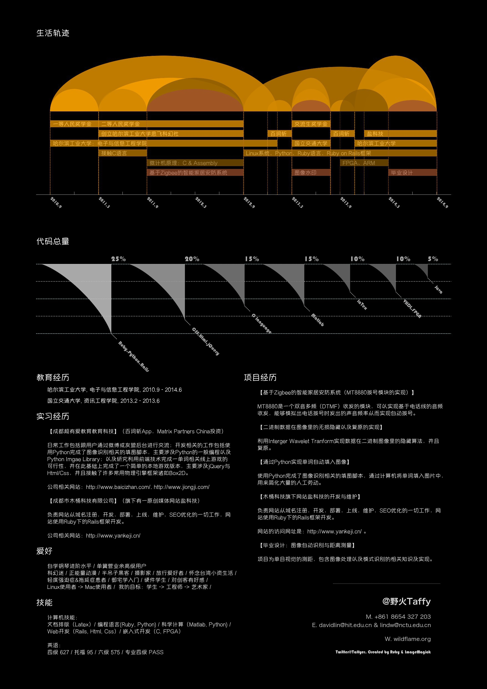

ResumeMagick
============

## 简介

此脚本可以用来生成一个漂亮的简历。

字体的相关配置文件在`config/config.yml`里。

第一个部分的相关文件在`events.yml`里。

## 使用方法

    ruby main.rb

## 依赖
 
-   ImageMagick
-   RMagick

## Demo 范例

### White Version 白色的版本
 

### Black Version 黑色的版本

## TODO:

1.   Support on yaml config file. (Move every thing to these files)

